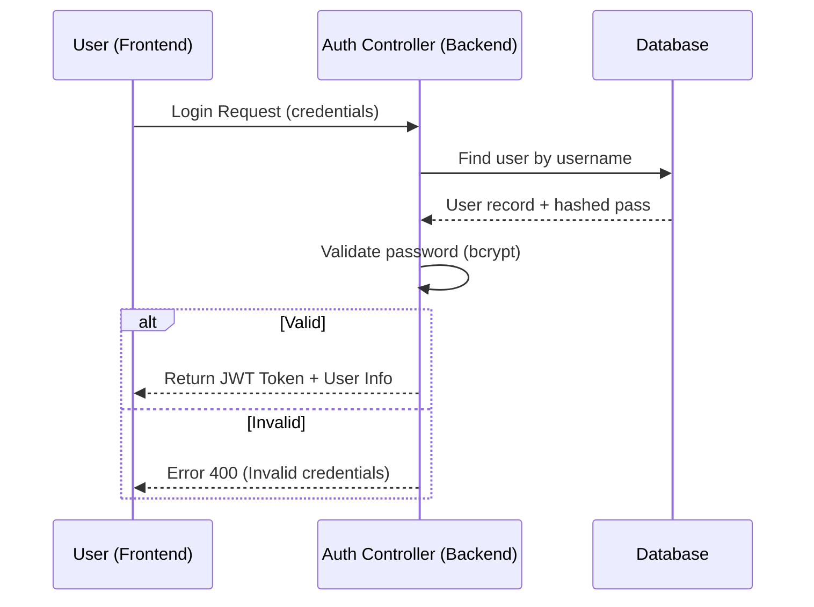
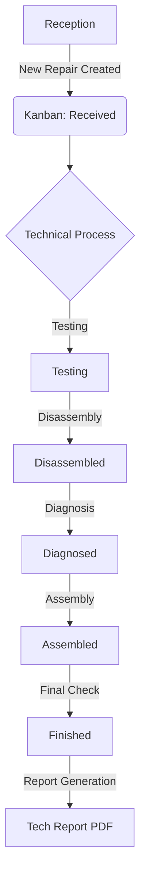
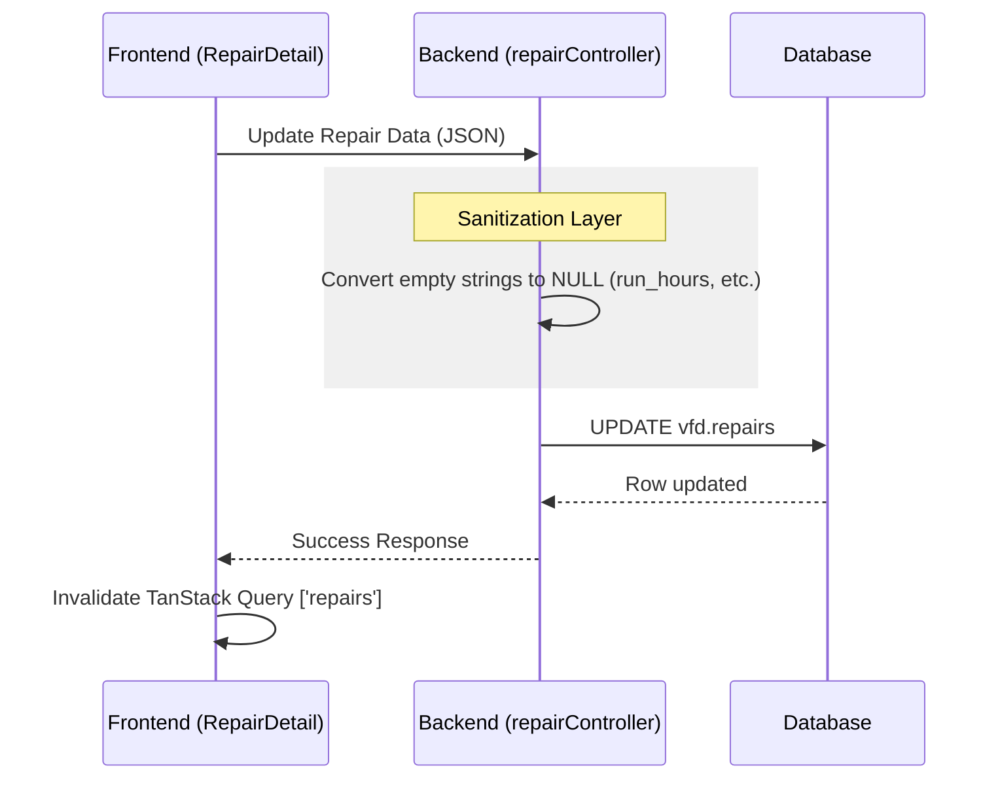
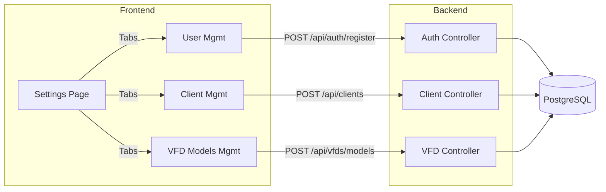

# Data Flow Diagrams

These diagrams explain how information moves through the system for key processes.

## 1. Authentication Flow

## 2. Repair Lifecycle Flow

## 3. Repair Data Persistence (Sanitization & Sync)

## 4. Settings Management (Admin Only)

