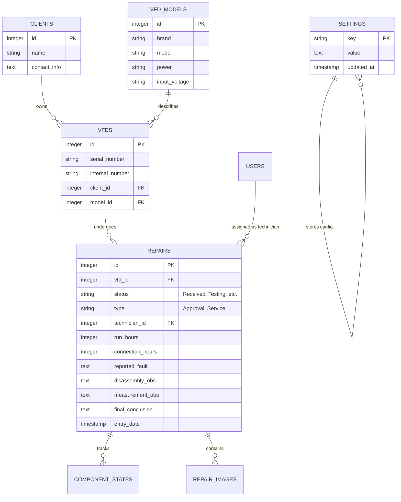

# Database Schema Documentation

The system uses a highly structured PostgreSQL schema defined in the `vfd` namespace.

## Table Relationships

## Key Considerations
- **Sanitization**: Fields like `run_hours` and `connection_hours` MUST be handled as `integer` or `NULL` in the backend. Attempts to save empty strings `""` will cause a PostgreSQL error.
- **Images**: `repair_images` stores file paths relative to the `/uploads` directory.
- **Workflow**: `status` column drives the Kanban board positioning.
